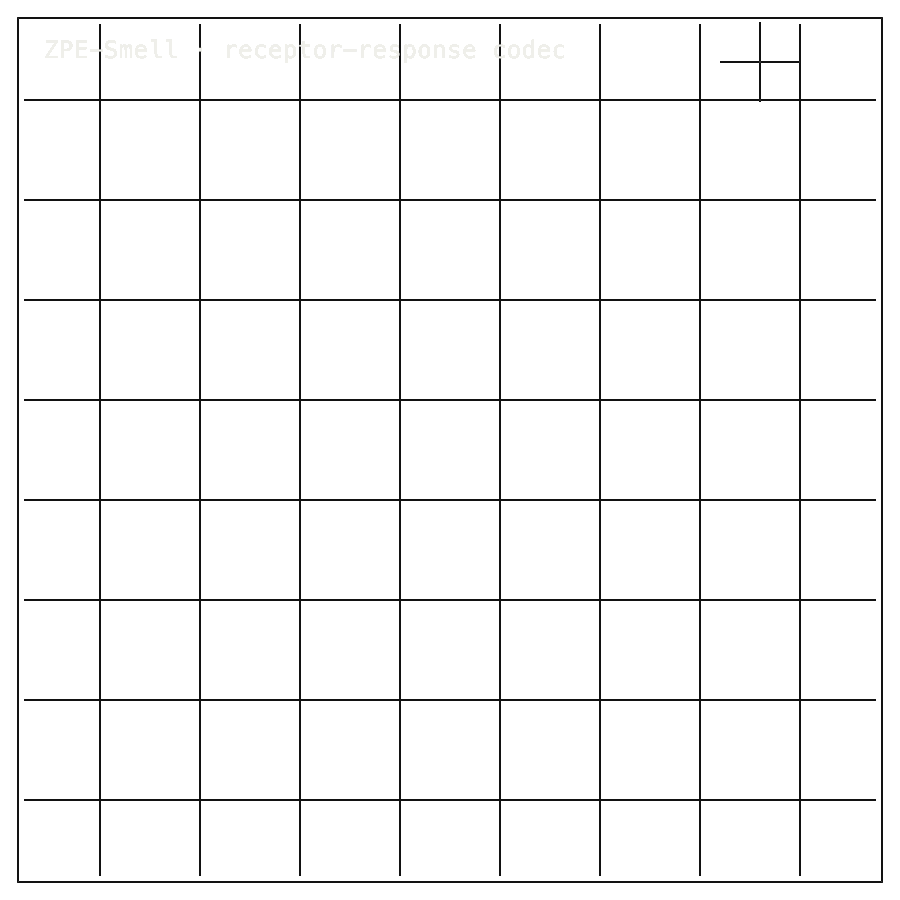

# ZPE-Smell

## Package Install

Installable package: `python3.11 -m pip install zpe-smell`.
Current release: `0.1.0` on [PyPI](https://pypi.org/project/zpe-smell/).
Source: [Zer0pa/ZPE-Smell](https://github.com/Zer0pa/ZPE-Smell/).

```bash
python3.11 -m pip install zpe-smell
```

For full install, smoke, source, and developer commands, [click here](#install-developer-commands-detailed).

---

<table width="100%">
<tr>
<td width="100%" valign="top">
<div><span><b>00 · ZPE-SMELL</b> · SURROGATE RECEPTOR PANEL</span> <span>RESEARCH-READY · SURROGATE SCOPE</span></div>
      <h1>A surrogate nose <span>for AI.</span></h1>
      <p>Surrogate receptor-response codec · ZPE-Smell · PyPI <em>zpe-smell</em> v0.1.0 · github.com/Zer0pa/ZPE-Smell</p>
      <p>ZPE-Smell does not smell. It takes a molecule and produces a deterministic surrogate receptor-response packet &mdash; a fixed barcode you can store, retrieve, and compare. On a 35-episode benchmark the packet survives encode and decode at <strong>Spearman 0.9996</strong>, retrieves the right neighbor at <strong>NN@1 94.29%</strong>, and never confuses a mixture, fiber, or adaptation category with another. It is a tool for cheminformatics retrieval and benchmark calibration. It is not empirical olfaction.</p>
</td>
</tr>
</table>

<table width="100%">
<tr>
<td width="100%" valign="top">
<figure>
        <div></div>
        <figcaption><b>Scope:</b> surrogate receptor-response barcode only. No empirical olfaction, biological validation, or digital-smell product claim.</figcaption>
      </figure>
</td>
</tr>
</table>

<table width="100%">
<tr>
<td width="100%" valign="top">
<div><b>01 · THE GAP</b> <span>NO SHARED BARCODE</span></div>
      <h2>Olfactory computation has no shared response barcode. Each pipeline encodes a molecule differently, so the same query returns different shortlists.</h2>
</td>
</tr>
</table>

<table width="100%">
<tr>
<td width="100%" valign="top">
<div><b>02 · MARKETS</b> <span>ADJACENT FORECASTS</span></div>
      <div>
        <div>
          <div><span>Cheminformatics</span>  <span>'30 · $14.5B</span></div>
          <div><span>Computational chemistry</span>  <span>'34 · $4.4B</span></div>
          <div><span>Molecular fingerprint tooling</span>  <span>'30 · est. $2.1B</span></div>
          <div><span>Drug discovery informatics</span>  <span>'30 · $8.9B</span></div>
          <div><span>Cheminformatics</span>  <span>'33 · $16.7B</span></div>
        </div>
      </div>
      <div>ZPE-Smell sits in the surrogate response layer of cheminformatics &mdash; not in empirical olfaction commerce.</div>
</td>
</tr>
</table>

<table width="100%">
<tr>
<td width="50%" valign="top">
<div><b>03 · VALUE OF MARKET</b></div>
      <div>$14.5<span>B</span></div>
      <div>Cheminformatics by 2030 &mdash; the surrogate response layer underneath retrieval and similarity search.</div>
</td>
<td width="50%" valign="top">
<div><b>04 · INSIGHT</b></div>
      <h2>One molecule, one neighborhood &mdash; and nothing <span>aliases.</span></h2>
</td>
</tr>
</table>

<table width="100%">
<tr>
<td width="50%" valign="top">
<div><b>05.1 · CURRENT TECH</b> <span>NO SHARED CODEC</span></div>
        <p>Olfaction datasets each carry receptor, geometry, and nuisance information differently. Two pipelines querying the same molecule rarely return the same shortlist, and there is no shared way to ask whether they should.</p>
</td>
<td width="50%" valign="top">
<div><b>05.2 · OUR TECH</b> <span>SURROGATE BARCODE</span></div>
        <p>ZPE-Smell builds a single deterministic response packet for any candidate molecule, then tests whether the response order and nuisance boundaries survive round-trip. On a fixed 35-episode benchmark the packet holds <strong>Spearman 0.9996</strong>, retrieves the right neighbor at <strong>94.29%</strong>, and refuses to alias mixtures, fibers, or adaptation responses into each other.</p>
</td>
</tr>
</table>

<table width="100%">
<tr>
<td width="100%" valign="top">
<div><b>05.3 · BENCHMARKS</b> <span>35-EPISODE SURROGATE PANEL</span></div>
      <div>
        <div>
          <div><span>Spearman</span><b>0.9996</b><small>rank fidelity</small></div>
          <div><span>NN@1</span><b>94.29</b><small>% retrieval</small></div>
          <div><span>Collision</span><b>0.00</b><small>% mixtures</small></div>
          <div><span>Episodes</span><b>35</b><small>benchmark scope</small></div>
        </div>
        <div>
          <div><span>full</span>  <span>0.9996</span></div>
          <div><span>geometry</span>  <span>0.9862</span></div>
          <div><span>receptor</span>  <span>0.9648</span></div>
        </div>
      </div>
      <div><b>Scope:</b> 35-episode surrogate panel &middot; computational-olfaction reference, not empirical perception.</div>
</td>
</tr>
</table>

<table width="100%">
<tr>
<td width="34%" valign="top">
<div><b>06 · MEASUREMENT</b> <span>35-EPISODE SURROGATE</span></div>
      <h2>Every metric traces to a 35-episode surrogate benchmark. <span>Collisions: zero.</span></h2>
</td>
<td width="66%" valign="top">
<div><b>06.1 · COMPARATIVE PERFORMANCE · SPEARMAN RANK FIDELITY</b></div>
      <div>
        <div>
          <div><span>ZPE-Smell full</span>  <span>0.9996</span></div>
          <div><span>Receptor-only</span>  <span>0.9648</span></div>
          <div><span>Geometry-only</span>  <span>0.9862</span></div>
          <div><span>Empirical receptor data</span>  <span>not public</span></div>
        </div>
      </div>
      <div><strong>35-episode surrogate benchmark</strong> &middot; the full barcode beats the receptor-only and geometry-only versions &middot; no empirical receptor data appears, because the codec does not claim it.</div>
</td>
</tr>
</table>

<table width="100%">
<tr>
<td width="100%" valign="top">
<div><b>07 · KEY METRICS</b> <span>ZPE-SMELL SURROGATE</span></div>
</td>
</tr>
</table>

<table width="100%">
<tr>
<td width="100%" valign="top">
<div><b>07.1 · SURROGATE SPEARMAN</b></div>
      <div>0.9996</div>
      <div>Rank fidelity &middot; <b>full surrogate vector</b></div>
</td>
</tr>
</table>

<table width="100%">
<tr>
<td width="100%" valign="top">
<div><b>07.2 · NN@1 RETRIEVAL</b></div>
      <div>94.29<span>%</span></div>
      <div>Right neighbor first &middot; <b>35-episode surrogate</b></div>
</td>
</tr>
</table>

<table width="100%">
<tr>
<td width="100%" valign="top">
<div><b>07.3 · MIXTURE COLLISION</b></div>
      <div>0.00<span>%</span></div>
      <div>Mixtures stay distinct &middot; <b>0/35 collisions</b></div>
</td>
</tr>
</table>

<table width="100%">
<tr>
<td width="100%" valign="top">
<div><b>07.4 · ABLATION FLOOR</b></div>
      <div>0.96<span>/ 0.99</span></div>
      <div>Receptor / geometry alone &middot; <b>0.96 / 0.99</b></div>
</td>
</tr>
</table>

<table width="100%">
<tr>
<td width="100%" valign="top">
<div><b>07.5 · BENCHMARK SCOPE</b></div>
      <div>35<span>episodes</span></div>
      <div>Fixed surrogate panel &middot; <b>non-empirical scope</b></div>
</td>
</tr>
</table>

<table width="100%">
<tr>
<td width="100%" valign="top">
<div><b>08 · DISTINCTION</b> <span>ZERO COLLISION</span></div>
      <h2>Across 35 surrogate episodes, response packets stay distinct. <span>Collision = 0.</span></h2>
</td>
</tr>
</table>

<table width="100%">
<tr>
<td width="66%" valign="top">
<div><b>08.1 · WHAT THE PACKET PROVES</b> <span>COMMITTED ARTIFACTS</span></div>
      <p>Committed proof artifacts replay the <strong>35-episode surrogate benchmark</strong> to <strong>Spearman 0.9996</strong>, <strong>NN@1 94.29%</strong>, and <strong>0.00%</strong> collision across mixture, fiber, adaptation, and transport-attack families. Each surrogate episode resolves to one and only one response barcode.</p>
      <p>Ablations land where they should: receptor-only at 0.9648, geometry-only at 0.9862, full vector at 0.9996. The replay is what we own. The empirical olfactory claim is what we explicitly do not.</p>
</td>
<td width="34%" valign="top">
<div><b>08.2 · HONEST BLOCKER</b></div>
      <span>Honest Blocker &middot;</span>
      <p><strong>Surrogate receptor-response panel only</strong> &mdash; no empirical olfactory perception, no biological receptor validation, no applied digital-smell product. Public PyPI <strong>zpe-smell 0.1.0</strong> is stale pending release. Proof and reference artifacts still cite <em>source_commit = 48507cbfcdc5</em>; source, license, and provenance drift remain open.</p>
</td>
</tr>
</table>

<table width="100%">
<tr>
<td width="33%" valign="top">
<div><b>09</b> </div>
      <h2>EVERY ODORANT GETS A <span>RECEIPT.</span></h2>
</td>
<td width="67%" valign="top">
<div><b>09.1 · THE AMBITION</b></div>
      <p>The ambition is a custody layer for computational smell. When every candidate molecule carries a reproducible response barcode &mdash; with its scope, its non-claims, and its nuisance boundaries spelled out &mdash; cheminformatics teams, QA labs, and standards bodies can argue over thresholds instead of definitions.</p>
</td>
</tr>
</table>

<table width="100%">
<tr>
<td width="33%" valign="top">
<div><b>09.2 · WHAT WORKS NOW</b></div>
        <h2>Working today: a surrogate response packet that distinguishes 35 fixed episodes without aliasing any nuisance family.</h2>
</td>
<td width="67%" valign="top">
<div><b>09.3 · WHAT'S STILL OPEN</b></div>
        <h2>Still open: empirical receptor data, broader certified-subset admission, release freshness, and source-provenance drift in proof artifacts.</h2>
</td>
</tr>
</table>

<table width="100%">
<tr>
<td width="100%" valign="top">
<div><b>09.4</b> &middot; RETRIEVAL · NEAR-TERM (12–24 MO)</div>
      <div>Fragrance archives query by response, not guess</div><div>A perfumer searching a corporate aroma archive for things that smell adjacent to a new accord gets back the same shortlist on Monday as on Friday. The match list stops shifting with whichever fingerprint vendor the chemoinformatics team last licensed.</div>
</td>
</tr>
</table>

<table width="100%">
<tr>
<td width="100%" valign="top">
<div><b>09.5</b> &middot; QA · NEAR-TERM (12–24 MO)</div>
      <div>Food and beverage QA gets a portable yardstick</div><div>A quality team checking that a new batch of vanillin or hop oil sits inside the expected response neighborhood can compare today's batch to a five-year-old reference and see the same distance number. Off-batches stop being judged by whichever panelist showed up.</div>
</td>
</tr>
</table>

<table width="100%">
<tr>
<td width="100%" valign="top">
<div><b>09.6</b> &middot; STANDARDS · MID-TERM (24–48 MO)</div>
      <div>Standards bodies acquire a calibration tool</div><div>An ISO or ASTM working group writing computational olfaction evaluation language has a public, deterministic packet to point at when it wants to define what rank fidelity and nuisance collision mean. Working groups stop arguing definitions and start arguing thresholds.</div>
</td>
</tr>
</table>

<table width="100%">
<tr>
<td width="100%" valign="top">
<div><b>09.7</b> &middot; DISCOVERY · MID-TERM (24–48 MO)</div>
      <div>Discovery pipelines feed cleaner candidates upstream</div><div>A drug discovery or flavor-house hit-finding pipeline that screens millions of molecules sends a surrogate response packet alongside each candidate. Wet-lab chemists triaging the top thousand can sort by response-space neighborhood before committing bench time, not after.</div>
</td>
</tr>
</table>

<table width="100%">
<tr>
<td width="100%" valign="top">
<div><b>09.8</b> &middot; SENSES · PARADIGM (48 MO+)</div>
      <div>Computational senses acquire a custody standard</div><div>Every codec that claims to represent a sense &mdash; smell, taste, touch, sight &mdash; is held to the same template: publish the surrogate scope, publish the nuisance boundaries, publish what it does not claim. The honest non-claim becomes how a sensory codec earns the right to be cited.</div>
</td>
</tr>
</table>

---

<a id="install-developer-commands-detailed"></a>

## Install / Developer Commands Detailed

<!-- INSTALL-DX:START -->
#### Package Install

Installable package: `python3.11 -m pip install zpe-smell`.
Current release: `0.1.0` on [PyPI](https://pypi.org/project/zpe-smell/).
Source: [Zer0pa/ZPE-Smell](https://github.com/Zer0pa/ZPE-Smell/).

```bash
python3.11 -m pip install zpe-smell
```

Import smoke:

```bash
python3.11 - <<'PY'
import importlib.metadata as md
import zpe_smell

print("zpe-smell", md.version("zpe-smell"))
PY
```


CLI smoke:

```bash
zpe-smell-reproduce --help
```

Install success only proves package acquisition/import. Product scope, stale PyPI state, platform limits, and blockers remain in the front-door sections below.
- PyPI copy is stale or pending refresh; install success is not product readiness.
<!-- INSTALL-DX:END -->

#### Quick Start

```bash
python3 -m venv .venv
. .venv/bin/activate
python3 -m pip install --upgrade pip
python3 -m pip install -e '.[dev]'
python3 -m zpe_smell.reproduce --output validation/results/latest_public_eval.json
python3 -m pytest -q
```
